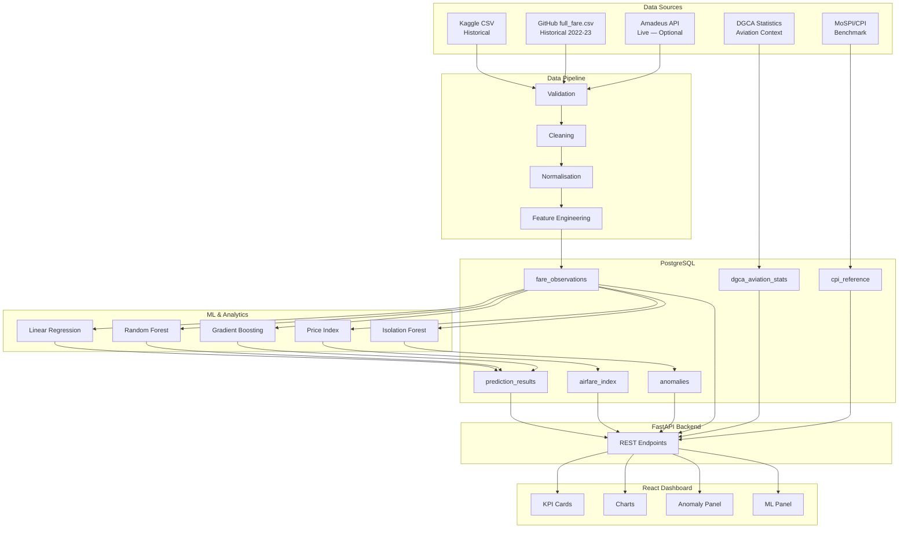

# AIRFARE INTELLIGENCE INDIA
## Real-Time Airfare Price Index & Aviation Market Analytics

**SIH 2026 — Problem Statement 26056**  
**Team: Neural Nexus Disruptors**

> **Prototype Notice:** This is a hackathon prototype. The Prototype Airfare Price Index produced by this system is **not an official Government of India index**. All data sources, limitations, and methodology are documented below.

---

## Table of Contents

1. [Problem Statement](#1-problem-statement)
2. [Solution Overview](#2-solution-overview)
3. [Architecture](#3-architecture)
4. [Data Sources & Their Roles](#4-data-sources--their-roles)
5. [Project Structure](#5-project-structure)
6. [Data Pipeline](#6-data-pipeline)
7. [Prototype Airfare Price Index Methodology](#7-prototype-airfare-price-index-methodology)
8. [Machine Learning Methodology](#8-machine-learning-methodology)
9. [Anomaly Detection](#9-anomaly-detection)
10. [DGCA Integration](#10-dgca-integration)
11. [MoSPI / CPI Relationship](#11-mospi--cpi-relationship)
12. [Quick Start — Local Setup](#12-quick-start--local-setup)
13. [Demo Mode](#13-demo-mode)
14. [Amadeus API Setup](#14-amadeus-api-setup)
15. [Database Setup](#15-database-setup)
16. [Docker Setup](#16-docker-setup)
17. [Testing](#17-testing)
18. [Limitations](#18-limitations)
19. [Future Scope](#19-future-scope)

---

## 1. Problem Statement

The Consumer Price Index (CPI) in India, maintained by MoSPI, does not yet include a systematic, automated airfare component derived from real-time data. Domestic airfares are highly dynamic and are a relevant indicator of service-sector price movements. This project develops a prototype system to:

- Collect and manage historical and current airfare observations.
- Build a transparent **Prototype Airfare Price Index** for Indian domestic routes.
- Predict airfare movements using machine learning.
- Detect unusual fare movements (anomaly detection).
- Contextualise results with official DGCA aviation statistics.
- Relate the prototype index to MoSPI/CPI methodology.

---

## 2. Solution Overview

```
┌──────────────────────────────────────────────────────────────────┐
│              AIRFARE INTELLIGENCE INDIA                          │
│    Real-Time Airfare Price Index & Aviation Market Analytics     │
└──────────────────────────────────────────────────────────────────┘

Data Sources
  ├── Kaggle (Historical ML training data)
  ├── GitHub full_fare.csv (Historical 2022–2023 fare observations)
  ├── Amadeus API (Live/current fare quotes — optional)
  ├── DGCA (Aviation statistics — NOT fare data)
  └── MoSPI/CPI (Benchmark context — NOT fare data)
       │
       ▼
Data Pipeline (Clean → Normalize → Persist)
       │
       ▼
PostgreSQL Database
       │
       ├── ML Model Training → Fare Prediction
       ├── Prototype Airfare Price Index Calculation
       └── Anomaly Detection
               │
               ▼
FastAPI Backend (REST API)
               │
               ▼
React Dashboard (Professional Analytics UI)
```

---

## 3. Architecture



---

## 4. Data Sources & Their Roles

### A. Kaggle — Flight Price Prediction (PRIMARY ML TRAINING DATA)

| Attribute | Value |
|-----------|-------|
| URL | https://www.kaggle.com/datasets/shubhambathwal/flight-price-prediction |
| File | `data/raw/Clean_Dataset.csv` |
| Role | **ML training & historical fare analysis** |
| Data Mode | `HISTORICAL` |
| Period | Historical booking observations |

**Important Limitations:**
- This is historical booking data, not live pricing.
- Collection timestamps are not fabricated.
- Used primarily for ML model training and evaluation.
- Not claimed to represent current market conditions.

### B. GitHub — full_fare.csv (HISTORICAL TREND DATA)

| Attribute | Value |
|-----------|-------|
| URL | https://github.com/Avij112/flight-fare-analysis |
| File | `data/raw/full_fare.csv` |
| Role | **Historical trend analysis, route-level fare analysis, index validation** |
| Data Mode | `HISTORICAL` |
| Period | 2022–2023 observed fares |

**Important Limitations:**
- 2022–2023 actual observations only.
- Interpolated/synthetic years are NOT treated as actual data.
- Clearly labelled as HISTORICAL throughout the application.

### C. Amadeus — Live Fare Data (OPTIONAL / LIVE)

| Attribute | Value |
|-----------|-------|
| URL | https://developers.amadeus.com/ |
| API | Flight Offers Search API |
| Role | **Current/live fare quotes** |
| Data Mode | `LIVE` |

**Important Limitations:**
- Amadeus does NOT represent the complete Indian airfare market.
- Complete market coverage is NOT claimed.
- Application functions fully without Amadeus credentials (DEMO mode).
- Credentials are NEVER hardcoded or committed to version control.

### D. DGCA — Aviation Statistics (CONTEXT DATA — NOT FARES)

| Attribute | Value |
|-----------|-------|
| URL | https://dgca.gov.in/ |
| File | `data/external/dgca_stats.csv` (manually placed) |
| Role | **Aviation market context: passenger traffic, flights operated, capacity** |

**Important Limitations:**
- DGCA data is aviation activity data — NOT ticket fare data.
- DGCA values are NOT used as fare observations.
- Stored in a separate table (`dgca_aviation_stats`).
- Causation between fare movements and traffic is NOT implied.

### E. MoSPI / CPI — Benchmark Context (NOT FARE DATA)

| Attribute | Value |
|-----------|-------|
| URL | https://cpi.mospi.gov.in/ |
| Role | **CPI methodology context and benchmark comparison** |

**Important Limitations:**
- CPI values are NOT used as airfare observations.
- CPI is NOT used as ML training data.
- Official CPI weights are NOT invented.
- The prototype index is clearly distinguished from the official CPI.

---

## 5. Project Structure

```
farecast/
├── backend/
│   ├── app/
│   │   ├── main.py              # FastAPI application entry point
│   │   ├── core/
│   │   │   ├── config.py        # Environment-based configuration
│   │   │   └── logging_config.py
│   │   ├── api/                 # API route handlers
│   │   ├── db/
│   │   │   ├── base.py          # SQLAlchemy engine & session
│   │   │   ├── models.py        # ORM models (8 tables)
│   │   │   └── init_db.py       # Table creation & seed data
│   │   ├── services/
│   │   │   ├── schema.py        # Common FareRecord + normalisation
│   │   │   └── cleaner.py       # Cleaning pipeline
│   │   ├── ml/                  # ML models & prediction (Phase 2)
│   │   ├── analytics/           # Index & anomaly calculation (Phase 3)
│   │   └── schemas/             # Pydantic request/response schemas
│   ├── requirements.txt
│   └── Dockerfile
│
├── frontend/                    # React dashboard (Phase 5)
│
├── data/
│   ├── raw/                     # Place CSV files here
│   │   ├── Clean_Dataset.csv    # ← Kaggle data (download separately)
│   │   └── full_fare.csv        # ← GitHub data (download separately)
│   ├── processed/               # Cleaned data outputs
│   ├── external/
│   │   └── dgca_stats.csv       # ← DGCA data (place manually)
│   └── sample/                  # Small sample datasets for demo
│
├── models/                      # Saved ML models (Phase 2)
├── notebooks/
│   └── eda_fare_analysis.py     # EDA analysis script
├── scripts/
│   ├── load_kaggle.py           # Kaggle data ingestion
│   ├── load_github_fares.py     # GitHub fare data ingestion
│   ├── load_dgca.py             # DGCA statistics ingestion
│   ├── clean_fares.py           # Standalone cleaning script
│   └── run_pipeline.py          # Full pipeline orchestrator
├── tests/
│   └── test_cleaning.py         # Phase 1 tests
├── docs/
│   └── figures/                 # EDA charts
├── docker-compose.yml
├── pyproject.toml
├── .env.example
├── .gitignore
└── README.md
```

---

## 6. Data Pipeline

```
Raw CSV Files
    │
    ▼
Source-specific Loader (load_kaggle.py / load_github_fares.py)
    │  - Column detection & renaming
    │  - Type conversion
    │  - FareRecord construction
    ▼
Cleaning Pipeline (cleaner.py)
    │  1. Drop missing required fields (origin, destination, fare)
    │  2. Remove impossible fares (< ₹500 or > ₹20,00,000)
    │  3. Normalise city names → IATA codes
    │  4. Normalise airline names → canonical form
    │  5. Convert duration → minutes
    │  6. Clip invalid days_left values
    │  7. Normalise cabin class
    │  8. Remove duplicate fingerprints
    ▼
PostgreSQL: fare_observations
    │
    ▼
Feature Engineering → ML Training (Phase 2)
Index Calculation → airfare_index (Phase 3)
Anomaly Detection → anomalies (Phase 3)
```

**Reproducibility:** The pipeline can be re-run from scratch using `scripts/run_pipeline.py`. Existing records for a source are deleted before re-ingestion to prevent duplicates.

---

## 7. Prototype Airfare Price Index Methodology

**Name:** Prototype Airfare Price Index  
**Status:** Prototype analytical index — NOT an official Government of India series.

### Calculation

For a given route and time period:

```
Index(route, t) = (Average Fare in period t / Average Fare in baseline period) × 100
```

**Interpretation:**
- `100` = Baseline level
- `110` = Approximately 10% above baseline
- `90` = Approximately 10% below baseline

### Baseline

- The baseline period is defined from the earliest available historical data.
- The baseline period, observation count, data source, and methodology are displayed alongside every index value.

### Aggregation (if used)

- Where route-level indices are aggregated, prototype weights are used.
- These weights are NOT official MoSPI/CPI weights.
- All weights are clearly labelled as "prototype weights."

---

## 8. Machine Learning Methodology

**Target variable:** `fare` (INR)

**Models compared:**
1. Linear Regression (baseline)
2. Random Forest Regressor
3. Gradient Boosting / HistGradientBoosting
4. CatBoost (if available)

**Features used:**
- Airline, origin, destination, cabin class (categorical → encoded)
- Stops, duration_minutes, days_left (numeric)
- Departure/arrival time period (categorical)
- Derived: route, departure_hour, weekend/weekday

**Evaluation metrics:** MAE, RMSE, R²

**Model accuracy is calculated from actual evaluation — never invented.**

---

## 9. Anomaly Detection

**Approach:**
1. Statistical baseline (IQR-based) per route
2. Isolation Forest for multivariate anomaly scoring

**Output severity:** `NORMAL` | `WATCH` | `HIGH`

**Important:** Anomalies are labelled as "Unusual fare movement detected" — not as fraudulent or manipulated fares.

---

## 10. DGCA Integration

DGCA aviation statistics are loaded into a separate `dgca_aviation_stats` table.

**Used for:**
- Domestic passenger traffic trends
- Flights operated by route/airline
- Seats offered / load factor
- Aviation market context in the dashboard

**NOT used for:**
- Airfare observations
- ML training data

Causation between fare movements and DGCA traffic metrics is NOT claimed.

---

## 11. MoSPI / CPI Relationship

The `cpi_reference` table stores MoSPI CPI data for the **Transport & Communication** group (the closest published CPI category to air travel).

**Used for:**
- Methodological benchmark and comparison context
- CPI augmentation narrative in the dashboard
- Understanding how the prototype relates to official CPI

**NOT used for:**
- Airfare observations
- ML training
- Inventing official weights

---

## 12. Quick Start — Local Setup & SIH Demo

### Prerequisites
- Python 3.11+
- Node.js 18+ (Node 25 tested) & npm

### Step 1: Environment Configuration
```bash
cp .env.example .env
# DEMO_MODE=true is enabled by default. No external credentials needed for demo.
```

### Step 2: Install Dependencies
```bash
# Python dependencies
pip install -r backend/requirements.txt

# Frontend dependencies
cd frontend
npm install
cd ..
```

### Step 3: Run Backend Tests
```bash
python -m pytest tests/ -v
# 101 tests passed across data cleaning, ML predictor, index analytics, and FastAPI endpoints.
```

### Step 4: Start FastAPI Backend
```bash
uvicorn backend.main:app --reload --port 8000
# API docs available at: http://localhost:8000/docs
# Health check: http://localhost:8000/health
```

### Step 5: Start React Frontend Dashboard
```bash
cd frontend
npm run dev
# Dashboard launches at: http://localhost:5173
```

### Step 6: Build Frontend for Production
```bash
cd frontend
npm run build
```

---

## 13. Demo Mode & Live Provider Architecture

Set `DEMO_MODE=true` in `.env` (this is the default).

In demo mode:
- Historical data from the local database is used for queries.
- Live APIs (Ignav / Amadeus) are not called unless configured.
- Results are strictly and visibly labelled as `DEMO` or `HISTORICAL`.
- DEMO mode is NEVER labelled as LIVE data.
- The application is fully functional without any API credentials.

---

## 14. Live Airfare Providers

### Primary Provider: Ignav API
FareCast integrates **Ignav** (`https://ignav.com`) as its primary real-time airfare data provider for Indian domestic routes (DEL, BOM, BLR, etc.).
- Configured via server-side environment variables:
  ```bash
  IGNAV_API_KEY=your_key_here
  IGNAV_BASE_URL=https://ignav.com
  ```
- **Token & Cost Protection:** Live searches are user-triggered only. Automated polling or background daemons that consume free allowance are intentionally disabled.
- When `IGNAV_API_KEY` is present, `/api/live/search` executes real live queries and tags results as `source="IGNAV"`, `data_mode="LIVE"`.
- If Ignav is unavailable or encounters network issues, FareCast safely falls back to DEMO historical mode without pretending to be live.

### Alternative Provider: Amadeus API
Amadeus remains supported as an enterprise alternative provider:
1. Register at https://developers.amadeus.com/
2. Add credentials to `.env`:
   ```bash
   AMADEUS_CLIENT_ID=your_client_id
   AMADEUS_CLIENT_SECRET=your_client_secret
   AMADEUS_HOSTNAME=test
   ```
3. When Ignav is not configured and Amadeus is enabled (`DEMO_MODE=false`), FareCast queries Amadeus.

**Credentials are NEVER committed to version control, logged, or exposed in API responses.**

---

## 15. Database Setup

### Local PostgreSQL

```bash
# Create database and user
psql -U postgres
CREATE USER farecast_user WITH PASSWORD 'your_password';
CREATE DATABASE farecast OWNER farecast_user;
\q

# Initialise tables
python -m backend.app.db.init_db
```

---

## 16. Docker Setup

```bash
# Copy and configure .env
cp .env.example .env

# Build and start all services
docker compose up --build

# Services available at:
#   PostgreSQL : localhost:5432
#   Backend API: http://localhost:8000
#   Frontend   : http://localhost:3000
#   API docs   : http://localhost:8000/docs
```

---

## 17. Testing

```bash
# Run all tests
pytest tests/ -v

# Run specific test file
pytest tests/test_cleaning.py -v

# Run with coverage (requires pytest-cov)
pytest tests/ --cov=backend --cov-report=term-missing
```

---

## 18. Limitations

1. **Kaggle data is historical** — it does not represent current market pricing.
2. **GitHub fare data is 2022–2023 observations only** — it should not be extrapolated to other periods.
3. **Amadeus does not cover the complete Indian airfare market** — only participating GDS-connected fares.
4. **DGCA provides aviation activity statistics, not ticket fares** — these data types are not mixed.
5. **The Prototype Airfare Price Index is not an official Government of India index** — it uses prototype weights and methodology.
6. **Model accuracy is computed from actual evaluation** — no accuracy claims are fabricated.
7. **Missing or unavailable data is not fabricated** — empty states are displayed with meaningful messages.
8. **CPI airfare-specific component weights are not officially published in usable form** — prototype weights are used and clearly labelled.

---

## 19. Future Scope

1. **Expanded data collection** — scraping more airline portals (with appropriate legal review).
2. **Officially published CPI airfare weights** — if MoSPI makes them available.
3. **Broader route coverage** — international routes.
4. **Time-series forecasting** — ARIMA/Prophet for index trend prediction.
5. **Seasonal decomposition** — disentangling trend, seasonality, and irregular components.
6. **API rate-limit management** — queue-based Amadeus requests.
7. **Real-time streaming** — Kafka/Spark for continuous fare monitoring.
8. **Integration with official statistical systems** — potential MoSPI collaboration.

---

*Built by Neural Nexus Disruptors for Smart India Hackathon 2026 — Problem Statement 26056.*
