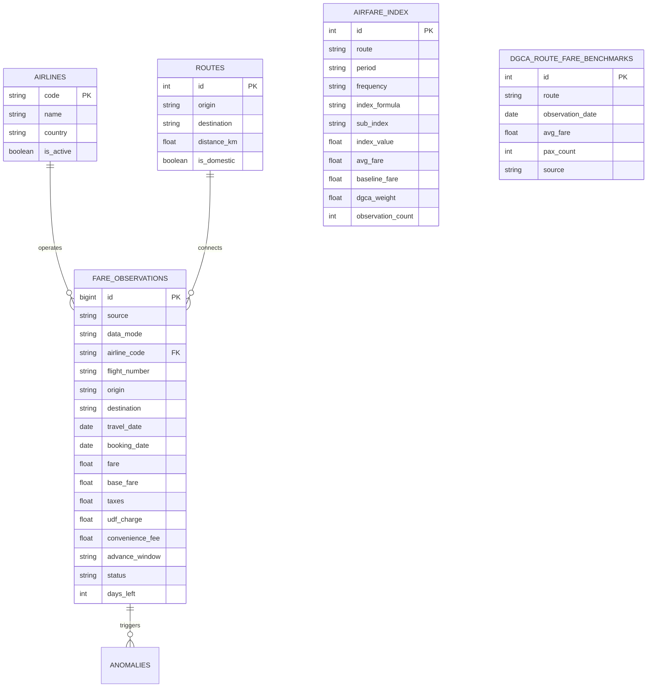
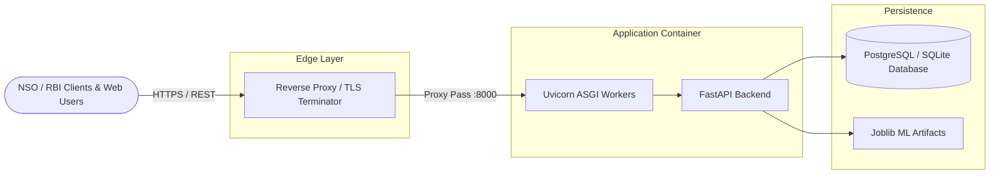

# System Architecture & Technical Specifications: FARECAST Platform

**Document Version:** 4.1.0  
**Target Stakeholders:** Ministry of Statistics & Programme Implementation (MoSPI / NSO), Reserve Bank of India (RBI), Technical Evaluation Committee.

---

## 1. Executive Summary

The **FARECAST Platform** is an enterprise-grade real-time airfare intelligence and inflation measurement system designed specifically for the Indian domestic aviation sector. It continuously collects, disaggregates, cleanses, models, and disseminates retail airfare data to compute a high-frequency **Real-Time Airfare Price Index (APIx)** aligned with international statistical standards (Laspeyres and Fisher Ideal price index formulations).

```mermaid
flowchart TD
    subgraph Data_Collection ["Multi-Source Ingestion Tier"]
        Scrapers["Modular Ethical Scrapers\n(6E, AI, IX, QP, SG, OTAs)"]
        Simulator["High-Fidelity Dynamic Tariff Simulator"]
        Amadeus["Amadeus GDS Live API"]
        DGCA_Feed["DGCA Aviation Statistics & Benchmarks"]
    end

    subgraph Data_Processing ["Data Normalization & Cleaning Tier"]
        Disagg["Fare Disaggregation Engine\n(Base + Taxes + UDF + Conv. Fee)"]
        WindowClassifier["Advance Window Classifier\n(T+1, T+7, T+15, T+30, T+45)"]
        Cleaner["Sanitization & Outlier Pipeline\n(IQR Filter & Deduplication)"]
    end

    subgraph Persistence ["Persistence & Storage Tier (SQLite/PostgreSQL)"]
        DB[(FARECAST Core DB)]
        FareObs["fare_observations"]
        APIxIndex["airfare_index"]
        DGCABenchmarks["dgca_route_fare_benchmarks"]
    end

    subgraph Analytics_Engine ["Analytics & Econometric Tier"]
        IndexEngine["APIx Index Engine\n(DGCA Traffic Weights & Fisher/Laspeyres)"]
        BacktestEngine["30-Day DGCA Backtesting Engine\n(MAPE, Pearson r, Tracking Error)"]
        MLPredictor["Gradient Boosting ML Engine\n(Feature Engineering & Fare Inference)"]
    end

    subgraph Consumption_Tier ["Dissemination & Consumption Tier"]
        NSO_API["MoSPI / NSO Dissemination API\n(Daily/Weekly/Monthly APIx & CSV Export)"]
        RBI_API["RBI MPC Macro-Prudential Feed\n(Inflation Proxy & Volatility Spread)"]
        ReactDashboard["FARECAST Interactive Web App\n(React, Recharts, Lucide)"]
    end

    Data_Collection --> Data_Processing
    Data_Processing --> Persistence
    Persistence --> Analytics_Engine
    Analytics_Engine --> Consumption_Tier
```

---

## 2. Core Architecture Tiers

### 2.1 Multi-Source Ingestion Tier (`backend/app/scrapers/`)
- **Ethical Web Crawling**: Adheres strictly to `robots.txt`, implements randomized exponential backoff delays, rotates modern desktop User-Agents, and suppresses excessive concurrency.
- **Dual-Mode Engine**: Features live HTTP/JSON scraping with automated fallback to the **Deterministic Airline Tariff Simulator**, ensuring complete CI/CD reliability and offline demo stability without IP blacklisting.
- **Stratified Windows**: Automated multi-window sweep across 5 mandatory advance-purchase horizons ($T+1, T+7, T+15, T+30, T+45$).

### 2.2 Data Cleaning & Normalization Tier (`backend/app/services/`)
- **Fare Disaggregation**: Deconstructs all gross fare quotes into:
  $$\text{Total Bookable Fare} = \text{Base Tariff} + \text{Taxes \& Aviation Security Fee (ASF)} + \text{Airport UDF} + \text{Convenience Fee}$$
- **Airport UDF Registry**: Integrated official AERA/AAI departure tariffs for DEL, BOM, BLR, CCU, HYD, MAA, PNQ, AMD, GOI, etc.
- **Statistical Outlier Filtration**: Segmented Interquartile Range (IQR) filtering per route bucket to eliminate dynamic pricing extremes that could skew national statistical indices.

### 2.3 Econometric Index Construction Tier (`backend/app/analytics/index_engine.py`)
- **Laspeyres Index**: Evaluates current route prices weighted by DGCA annual domestic passenger traffic shares ($w_r$).
- **Fisher Ideal Index**: Computes geometric mean of Laspeyres and Paasche formulations for substitution bias mitigation.
- **Stratified Aggregation**: Multi-window weighted sub-indices (`COMPOSITE`, `T+1_SPOT`, `T+7_WEEK`, `T+15_STANDARD`, `T+30_PLANNED`, `T+45_EARLY`).

### 2.4 30-Day Validation & Backtesting Engine (`backend/app/analytics/backtest.py`)
- Empirically validates calculated APIx movements against official DGCA monthly/daily sector fare monitoring data.
- Continuously calculates **Pearson correlation ($r$)**, **Mean Absolute Percentage Error (MAPE)**, **Tracking Error**, and **Directional Accuracy**.

### 2.5 RESTful Dissemination Tier (`backend/app/api/routers/`)
- Built on high-performance FastAPI asynchronous framework.
- Dedicated regulatory endpoints for NSO (`/api/v1/nso/apix`, `/api/v1/nso/apix/export`) and RBI (`/api/v1/rbi/macro-feed`).

---

## 3. Database Schema Entity Relationship (ERD)

---

## 4. Production Deployment Topology

The system is fully containerized via `docker-compose.yml`, allowing horizontal scaling and automated background cron execution for nightly data sweeps.
