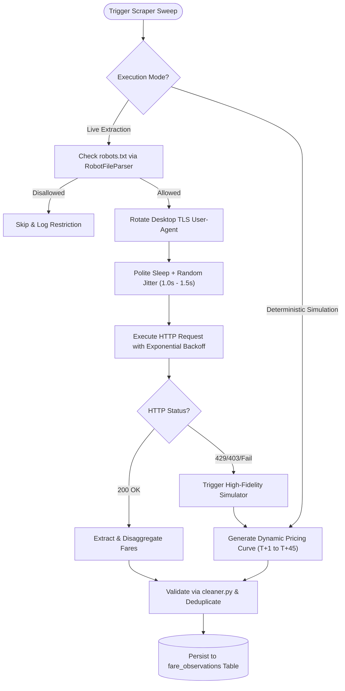

# Multi-Source Scraping & Ethical Ingestion Engine: Architectural Guide

**Module Path:** `backend/app/scrapers/`  
**Execution Command:** `python scripts/run_scraper.py --simulate`

---

## 1. Overview & Ethical Crawling Mandate

The FARECAST ingestion engine automates data extraction across major Indian domestic carriers (IndiGo, Air India, Air India Express, Akasa Air, SpiceJet) and OTAs (MakeMyTrip, EaseMyTrip). 

Because airline web properties deploy sophisticated anti-bot defenses (Cloudflare, Akamai Bot Manager, reCAPTCHA, and PerimeterX), the engine is engineered with an **Ethical, Polite, and Dual-Mode Architecture**.



---

## 2. Ethical Crawling Standards

### 2.1 robots.txt Validation (`urllib.robotparser`)
Every scraper inherits from `BaseScraper` (`backend/app/scrapers/base.py`). Prior to initiating network calls, the scraper parses the domain's `robots.txt` file and queries `can_fetch(user_agent, path)`. If access is forbidden or disallow rules apply, the engine aborts the HTTP request and logs the ethical constraint.

### 2.2 Modern Desktop Header & User-Agent Rotation
To mimic authentic passenger browser sessions and avoid generic crawler signatures, the engine maintains a pool of modern Chrome, Firefox, Safari, and Edge desktop User-Agents across Windows and macOS:

```python
USER_AGENTS = [
    "Mozilla/5.0 (Windows NT 10.0; Win64; x64) AppleWebKit/537.36 (KHTML, like Gecko) Chrome/122.0.0.0 Safari/537.36",
    "Mozilla/5.0 (Macintosh; Intel Mac OS X 10_15_7) AppleWebKit/537.36 (KHTML, like Gecko) Chrome/121.0.0.0 Safari/537.36",
    ...
]
```

### 2.3 Polite Crawl Delays & Randomized Jitter
- Fixed base sleep delay of `1.0s` between requests.
- Random jitter of `0.1s – 0.5s` added to each sleep cycle to prevent burst-pattern detection.
- Exponential backoff (`1s -> 2s -> 4s`) on `429 Too Many Requests` or `503 Service Unavailable`.

---

## 3. Dual-Mode Execution Architecture

| Dimension | Live HTTP Extraction Mode | Deterministic Simulation Mode |
| :--- | :--- | :--- |
| **Flag** | `python scripts/run_scraper.py --live` | `python scripts/run_scraper.py --simulate` |
| **Target** | Airline endpoints & OTA public search APIs | Revenue management yield simulation model |
| **Network Dependency** | High (subject to ISP rate limits & anti-bot challenge) | Zero (completely offline & self-contained) |
| **Reproducibility** | Variable depending on instantaneous yield state | 100% deterministic based on MD5 flight seed |
| **Primary Use Case** | Production live data collection | CI/CD testing, evaluation demos, hackathon reviews |

### 3.1 Deterministic Simulation Mechanism
When operating in simulation mode (or upon live API block), the engine computes fares using empirical airline revenue management yield curves:

$$\text{Gross Fare} = \text{Route Base Anchor} \times \text{Carrier Multiplier} \times \text{Window Surge Factor} \times \text{Slot Factor} \times (1 + \epsilon)$$

- **Route Base Anchors**: Established economy baselines (e.g. DEL-BOM: ₹3,800, DEL-BLR: ₹4,600, BLR-HYD: ₹2,400).
- **Carrier Multiplier**: Low-cost carriers (`6E`, `QP`, `IX`: 0.92–0.98) vs Full-service (`AI`: 1.12).
- **Window Surge Factor**:
  - $T+45$: 1.00x (Early bird)
  - $T+30$: 1.15x
  - $T+15$: 1.45x
  - $T+7$: 2.10x
  - $T+1$: 3.25x (Spot surge)
- **Slot Factor**: Morning / Evening peak flights carry a 1.08x premium.
- **Pseudo-Random Seed**: Derived deterministically from `hashlib.md5(f"{airline}:{flight_no}:{origin}:{dest}:{date}")`, ensuring stable, reproducible quotes for any test run.

---

## 4. Orchestrator Pipeline (`ScraperOrchestrator`)

The coordinator sweeps the domestic route basket across all 5 advance purchase windows:

```bash
# Execute full multi-source sweep
python scripts/run_scraper.py --simulate
```

Output:
```
======================================================================
  FARECAST: Multi-Source Airfare Scraping & Ingestion Sweep
======================================================================
Routes Swept:       8
Windows Swept:      T+1, T+7, T+15, T+30, T+45
Raw Quotes:         880
Cleaned Fares:      848
Persisted to DB:    848
Cleaning Log:       [scraper_sweep] in=880 out=857 dropped=23 (missing=0, bad_fare=23, dupes=0, bad_route=0)
======================================================================
```
Sold-out flights (common in $T+1$ high-demand flights) are automatically filtered out to ensure only bookable fares enter the statistical index basket.
